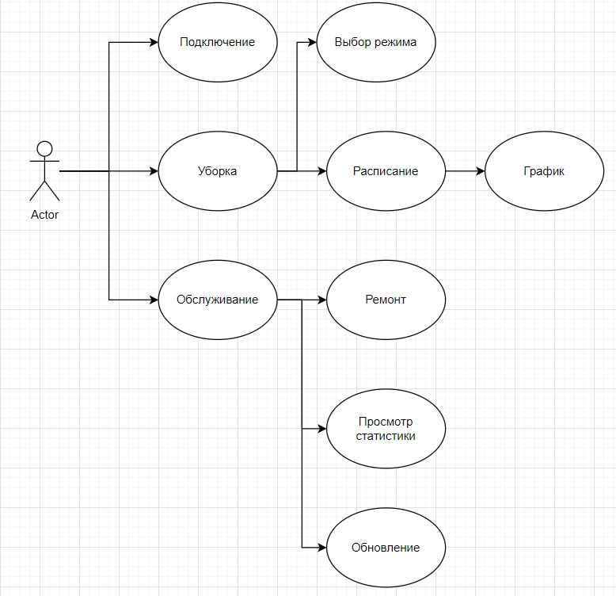
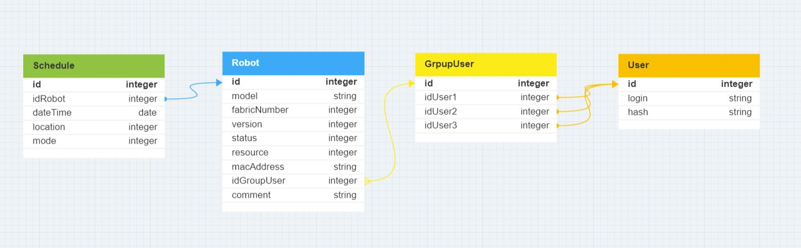
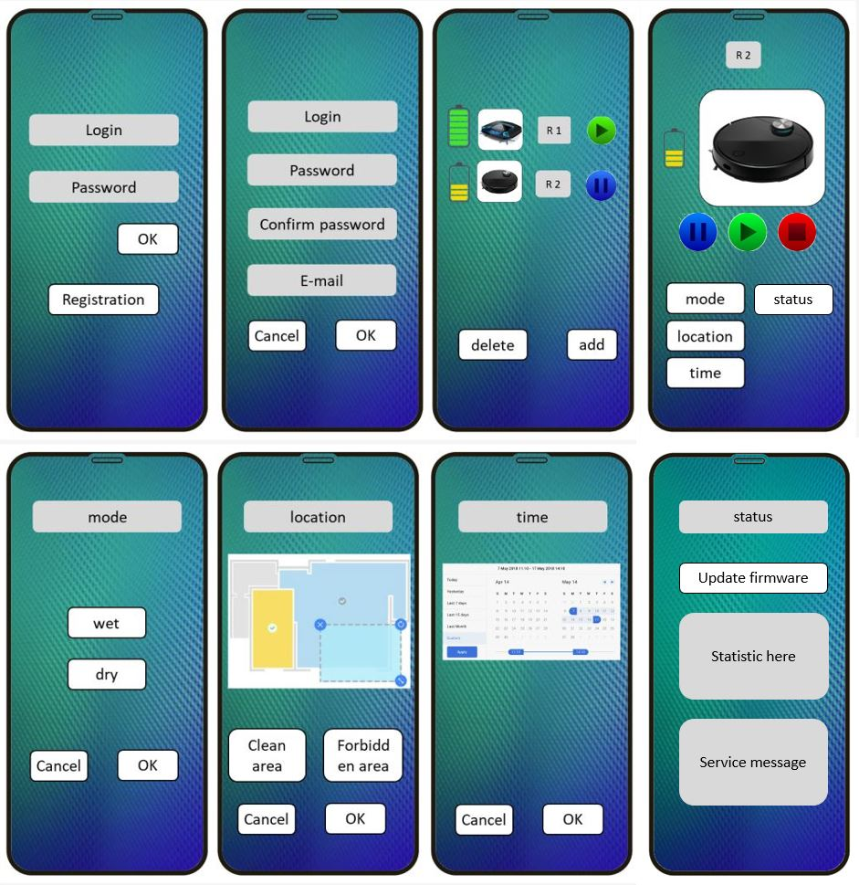

HomeWork 10 . 

Спроектировать пользовательский интерфейс (web-SPA, native mobile), основные компоненты (подключение робота, управление помещениями, расписание работы, сервисное обслуживание робота, история уборок), https://www.figma.com/  или https://app.diagrams.net/.
Спроектировать сценарии (Use case)(подключение, выбор помещения, программы уборки, настройка расписания, просмотр статистики..), в виде Актор – Прецедент (из первой лекции).
Спроектировать ER модель (https://www.dbdesigner.net/), 

